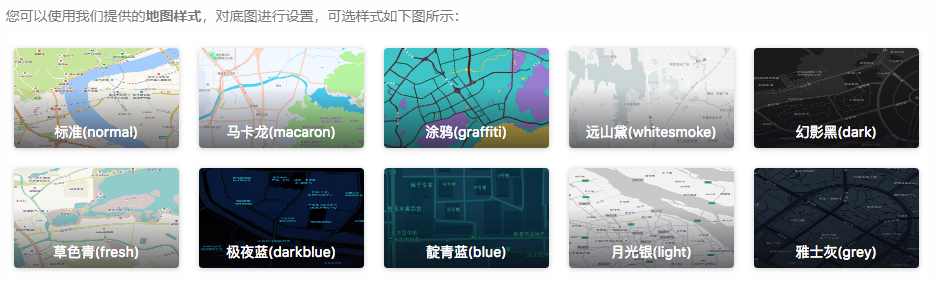

## 使用官方地图样式
可以使用官方提供的地图样式，对底图进行设置，可选样式如下图所示：



设置地图样式的方式有两种:

1. 在地图初始化时设置：
```
var map = new AMap.Map('container',{
    mapStyle: 'amap://styles/whitesmoke', //设置地图的显示样式
});
```
2. 地图创建之后使用Map对象的setMapStyle方法来修改：
```
var map = new AMap.Map('container',{
    zoom: 10, //设置地图的缩放级别
});
map.setMapStyle('amap://styles/whitesmoke');
```
可选参数：

-  标准 normal

-  幻影黑 dark

-  月光银 light

-  远山黛 whitesmoke

-  草色青 fresh

-  雅士灰 grey

-  涂鸦 graffiti

-  马卡龙 macaron

-  靛青蓝 blue

-  极夜蓝 darkblue

-  酱籽 wine
